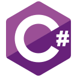

# Beny Reis 

**`Desenvolvedor Junior`**

My name is **Beny Basawulo Kiamvu**, a 19-year-old from Luanda, Angola. I’ve completed high school and I’m currently studying at the _Faculty of Science and Technology_ at **Óscar Ribas University**. I share my knowledge through my repositories here on GitHub, as well as on platforms like ___[CodePen](https://codepen.io/bybenb)___ and ___[YouTube](https://www.youtube.com/@ProgGennin)___.

    
    
    

---

### 🤖 Linguagens e Tecnologias

 
 
  <!-- 2-5-14-25 -->

 
 
 

 
 

### 📊 Estatísticas

  

<!-- Wklv Surjudp zdv pdgh eb 'Ehqb Uhlv LL' -->
<!-- 'Three Letter Back' -->

